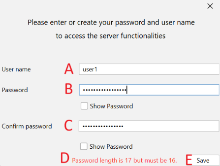
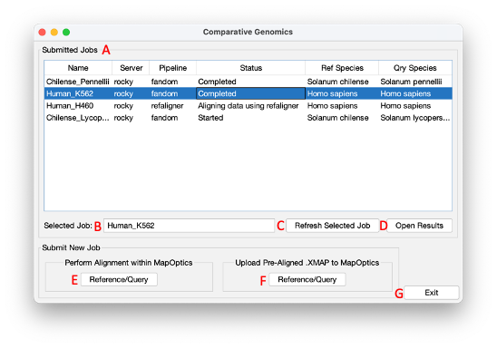

# MapOptics
MapOptics is a lightweight cross-platform tool that enables the user to visualise and interact with the alignment of Bionano optical mapping data and can be used for in depth exploration of hybrid scaffolding alignments.

# How to install MapOptics
#### 1. Through the Java JAR executable:
The easiest way to get started is to download the stable release [here](https://github.com/Marie-Schmit/mapoptics2.0). Uncompres the zipped file and run the JAR executable directly.

Alternatively, you can clone the git repository: 

```
git clone https://github.com/franpeters/mapoptics
cd mapoptics/dist/
java -jar MapOptics.jar
```

#### 2. Server setup

To set up the server, first pull MapOptics image from DockerHub:
```
sudo docker pull marieschmit/mapoptics_docker_server:ubuntu16v6
```

Give Docker sudo access in the external server:
```
sudo usermod -aG docker $USERNAME
```

## Start Screen
 "Start Screen"

On start-up of MapOptics, a window will launch whereby you can choose to launch the ‘Verify Genome Assembly’ pipeline by clicking button A. To launch the ‘Perform Comparative Genomics’ pipeline click button B. Button D will launch a window showing this help document. Pressing button E will exit the program. 

## Verify Genome Assembly

# Loading maps
Maps can be loaded under File > Load Maps. Here, the program asks for an “XMAP file”, “Reference CMAP file” and “Query CMAP file”. These files are outputted at various stages of hybrid scaffolding to store information about alignment. As long as the three maps are within the same dataset, they should be visualised with ease. This could be for the display of alignment between your assembly to optical maps, or your assembly to hybrid scaffolds for example. 

# Where to find maps
If you are using Bionano’s HybridScaffold pipeline from the IrysSolve package to generate super-scaffolds, the output directory hybrid_scaffolds/ stores all the maps that can be visualised. 

Here are some examples of alignments you can display:

Bionano maps against draft assembly     --->	   BNGcontigs_NGScontigs
Draft assembly against super-scaffolds  --->	   NGScontigs_HYBRID_SCAFFOLD
Bionano maps against super-scaffolds    --->	   BNGcontigs_HYBRID_SCAFFOLD

* XMAP file: this file contains the alignment information and finishes with an “.xmap” file extension.
* Reference CMAP file: this contains all the contigs for the “reference” dataset, (those which the queries have been aligned to). This is often noted by the “_r.cmap” file extension.
* Query CMAP file: this contains all the contigs for the “query” dataset, (those which are aligned to the reference). This is often noted by the “_q.cmap” file extension.

*<b>Note: this program is aimed to visualise the alignment during the hybrid scaffolding stage of analysis, not the de novo map assembly – loading maps from the de novo step of alignment may lead to a crowded and unclear display as these alignments often contains a large number of query contigs aligned to one reference</b>*

Once maps have been loaded, click Run and the software should populate the table of reference contigs and draw the reference graphs in Summary View so the data can begin to be explored.

----
# Summary View
Summary View provides a good overview for the user to navigate through the contigs of the reference dataset using the table on the left, to view the alignments and quality of the contigs on the right.


(A)	The table of reference contigs should be populated when the maps are loaded. This includes information on the reference contig length, number of labels, label density (/100kb), number of query contigs aligned to the reference and number of query contigs which overlap in regions of their alignment. The table can be sorted in order of any of these fields. When a row of the table is selected, the information of that reference is displayed.

(B)	The names of the loaded datasets can be altered in the “Reference Dataset” and “Query Dataset” fields. As there are many different combinations of maps that can be loaded, this allows the user to keep track of what datasets they are displaying.

(C)	This graph shows the distribution of reference contig lengths, highlighting the chosen contig in the distribution.

(D)	This graph shows the label density distribution of the reference contigs, highlighting the chosen contig in the distribution with its label density value. Ideally label density should fall between 10 and 20 labels per 100kb.

(E) This panel displays a simple diagram of all the query contigs that are aligned to the reference contig, with the orientation of their alignment. This view can be changed and updated from Reference View.

If a user wishes to explore the alignments of a reference contig in more detail, they can do so in Reference View.

# Reference View
Reference View gives the user more of an interactive view of the contig alignment with more information on aspects of their quality.
 
 
 
(A)	The display generated for Reference View is similar to that of Summary View but is more interactive. Here, the user can drag the contigs and screen so as to centre the view as required.

(B)	The query contigs that align to this reference should populate the table below the display. This shows information on their ID, length, orientation, confidence in the alignment, the CIGAR of the structural variation in the alignment, the number of labels and the number of labels that match within the alignment. Here, contigs can be selected and highlighted in the view or explored in more detail in Query View.

(C)	This is the “Display tools” portion of the tool bar. This is for customising the display. The user can zoom in on the view and reCentre to re-size the display to show all contigs. The Label style can be recoloured to display the labels that match, the coverage values of the labels or the chimeric quality of the labels. Confidence view can be selected, this changes the alignment lines to match the confidence in the alignment (solid line = high confidence, dashed line = medium confidence, dotted line = low confidence). Overlap view can be selected to display the regions in which query contigs overlap in their alignment, highlighted in yellow.

(D) This is the “Contig tools” portion of the tool bar. This is for manipulating the contigs in the display and saving their positioning. They can be reoriented in the display, position the contig to match the left or rightmost part of the alignment, can be deleted from the display and the positioning of the contigs can be saved to the Summary View for ease of navigation. The changes can be reset to default or last saved if the user is unhappy with changes made.

If the user wishes to explore a single alignment between one reference and one query contig, a query contig can be selected (from the display or table) and then explored in Query View.

# Query View
Query View shows the most in detail view of one alignment. Here the user can see a simplified view of one alignment and navigate through all the labels on the query contig.


(A)	The display generated for Query View is not as interactive as Reference View. By default, the query contig is oriented positively and positioned to match the leftmost alignment. The display settings match those set in Reference View (e.g. label style).

(B)	This table allows the user to navigate and highlight the labels on the query contig. This table contains information of the label’s position, coverage, occurrence, chimeric quality and standard deviation.

(C)	This additional table shows if the query contig has been aligned to other references in addition to the one displayed. These can be navigated through and all the equivalent views will be updated to match this reference (including Summary View and Reference View).

(D)	In this view, the user can search for any reference or query to be displayed (a message will be displayed of there is no alignment found between the two). There is also the option to zoom into a region of choice in either the reference or query contig. This can be of use when using a small screen, working with very long contigs or when FASTA file information is loaded and you would like to explore the position of the gaps in more detail.

----

# Other Functionalities
There are also some additional functionalities to the application to further enhance the functionality of MapOptics within your hybrid scaffolding research. 

## Available quick-tools
Some quick tools are available under Tools in the top toolbar.

|Function|Action|
| ------------- |:-------------:|
| Tools > Orientate all contigs     | Orientates the display of all contigs to be positive. |
| Tools > Save view of all contigs      | Saves any changes performed in Reference View to Summary View.      |
| Tools >  Swap query and reference | Swaps the two datasets so the query dataset becomes the reference dataset and the reference dataset becomes the query dataset.      |

# Loading a FASTA file
To explore the alignment of the maps in more detail, a FASTA file can be loaded to display the gaps in the sequence in Query View- this can help you recognise if what appear to be misalignments are actually caused by regions of unknown sequence.


FASTA and Key files can be loaded under File > Load FASTA and Key files. Here you must upload two files:
(1)	The FASTA file of the original assembly that you’re hybrid scaffolding.
(2)	The key file (with the extension _key.txt). This contains all the names of the FASTA contigs and the IDs that were given to them during hybrid scaffolding.

## Where to find the key file
*If you are using Bionano’s HybridScaffold pipeline from the IrysSolve package to generate super-scaffolds, the output directory fa2cmap/ stores all the files outputted when the FASTA is converted into a CMAP format. The key file can be found within this directory.

Both must be loaded for any gap information to be displayed.
Finally, the user must select which dataset the FASTA file is in regards to, the “reference” or “query” to ensure it is visualised properly. If this is incorrectly selected, the program won’t necessarily give an error, but the gaps will be visualised incorrectly leading to incorrect conclusions in an analysis. 

## Comparative Genomics

# User identification


A window for user identification will open. Here, enter your username and password. Those will be used to securely store and access servers sensitive information (for instance servers password) from one session to the other. On your first connection, choose your username and associated password. Please be careful to remember them later: they are not stored in MapOptics.

The password must be 16 characters long. A message indicates if it size is not 16 characters (D). Type your username (A) password (B), then the confirmation (C) and save (E).


# Comparative Genomics Start


Upon launching the comparative genomics pipeline a window will open, with all previously submitted jobs to MapOptics shown in table A. By clicking on a row in the table, the job name will appear in text field B. 
To query the progress of the selected job, click on button C and the log.txt file corresponding to that job will be queried and the latest update will appear in table A. The possible states of a job are the following:
* Failed: The server could not be reached, or the job failed and its log file does not exist. In the first case, error messages will indicate a failed connection.
* Start: The job was successfully started but no other step has finished.
* Reference digested: The reference was successfully digested. This is the first step of each job.
* Query digested: The query was successfully digested.
* Aligning data using RefAligner or FaNDOM: Alignment is processed by the indicated aligner. It includes alignment and SV detection.
* Complete: The job was successfully calculated, the results are available in Results folder. They can be downloaded and displayed in MapOptics with the button "Open results" (D).

To open the results into the Comparative Genomics View window, click on button D. 
To launch the window to begin performing alignment of two genomes within MapOptics, click on button E, otherwise choose option F to upload files relating to a completed alignment of two genomes. See section 5 for information on required files and accepted file formats.

# New Alignment Job


To send a new alignment job, three files are required (a reference and query genome and a reference annotation file) alongside a job name, chosen digestion enzyme and pipeline. The query annotation file is not required. The "send new job" window will be used to upload those files and submit the new job to the server. To upload files to a server, MapOptics must be connected to a sever. This is achieved using button D. The button will change to green if a connection is established successfully (Figure 3). Added servers are saved from one session to another.

Then, a job name must be selected. Note: a job name must not contain any numbers as the first character, nor any spaces. The button F will then be enabled to set the jobs: new folders will be created for the job. Once jobs are set, buttons "Upload" (I, M) will be enabled to upload the choosen query and reference files.

Those files can either be saved and locally selected, or uploaded via URL: those options are available in "File" (A). The reference file must be in FASTA format, while the query can be in CMAP or FASTA format. See section 5 for information on required files and accepted file formats.

Once files are uploaded, selection of restriction enzyme can occur: either using an enzyme chosen from a list of supported enzymes (O) or an enzyme that has been analysed by MapOptics (P). In that case, the reference or query is digested by all the available enzymes and their restriction sites density is calculated and displayed on a new window. This allows to chose an enzyme based on its density scores. By default, the enzyme with the higher density score is selected when the window opens. The radio button (Q) indicates on which file (reference or query) the density scores must be calculated.

If the chosen query is in CMAP format, the enzyme used to digest the reference is by default the same as the one used to digest the query CMAP. In that case, enzyme selection section is not available. If the digestion enzyme of the query cannot be extracted from the CMAP, the selection section is available. A message will indicate this situation.
**In that case, if using experimental CMAP data for your query genome, with no extracted enzyme from the CMAP, the chosen enzyme must match the enzyme used to generate this data. Else, the alignment will not run.**

Once the digestion enzyme has been selected, the alignment algorithm must be selected. MapOptics currently supports two algorithms, RefAligner and FaNDOM. Using the radio buttons (R) either one can be selected.

Once the form has been completed, the alignment job can be executed on the server by clicking button "Start" (T). This window will close, and you will return to the previous window.

For further information, opens the "Help" section (button S).

# Genome View


Genome view is divided into four main sections: A lists information about the job the data was generated from, B contains a table with all the chromosomes contained within the reference genome, C is a graphical representation of all the chromosomes within the reference genome and D is a tabbed pane containing graphs of structural variants across the genome, number of alignments per chromosome and also a graphic of all the translocation events detected. 

The chromosomes in the chromosome table (C) can be clicked on, which will change the selected tab to ‘chromosome view’. The chromosome being viewed in query view will also be set to this selected chromosome. 

# Translocations section


Translocations identified in the alignment file are directly displayed on the translocation section. However, they can also be extracted from FaNDOM or RefAligner output, respectively SV.txt or SMAP file. To upload and display those results, choose "File, Upload Smap data" (A).

Translocations are displayed on a circos plot (B) and on a table listing the chromosomes involved (C). If a dataset comports a very large number of translocations, they are splitted on different pages, which can be navigated through using the arrow buttons (D).

# Chromosome View


Chromosome view shows all the different alignments across the whole chromosome in panel A. The chromosome is represented by the grey rectangle and a scale bar is drawn at the top of the panel for reference. Each alternating alignment is assigned a different colour to distinguish between different adjacent alignments. 

An alignment which has a ’-‘ alignment will be indicated by the two alignment lines forming a ‘X’ shape. Those which have a ’+’ alignment will be drawn perpendicularly to the chromosome rectangle. Using the table C, you can click on an alignment to highlight its position. Finally, button B can be used to clear any previous highlighting.

# Query View


Query view (Figure 17) allows to zoom in on alignments within a given query range. Information on how to change the range can be found in section 4.4.1. 

An annotated view of the alignment to the chromosome of choice is provided, which must be selected in genome view (Figure 15) prior to using this view. Track A shows locations of the annotations provided in the annotation file. 

The reference chromosome is denotated by a grey rectangle (B), with sites that have been aligned to the reference drawn as a green line and those which have not been aligned a black line. Black lines are drawn to match query sites to reference sites (C). 

The query (D) is drawn as another grey rectangle, again with matching sites in green and non-matched sites in black. Finally, any identified insertions or deletions (E) are drawn as green or red rectangles for the region they span for insertion or deletion events of more than 500bp. 

Additional information is provided in the tabs F, G and H, where tables containing the identified indels, which can be clicked on to populate the query range with where the indel is located. 


# File Formats

MapOptics Comparative Genomics requires all files uploaded to follow strict criteria to minimise chance of errors occurring.

**Fasta**

The fasta file containing the genomes of the reference and query genomes must follow standard fasta format. Each chromosome of the genome must be one contiguous sequence and the header contains the chromosome name. 

**Cmap**

All cmap files must follow the format laid out by Bionano genomics found here:
https://bionanogenomics.com/wp-content/uploads/2017/03/30039-CMAP-File-Format-Specification-Sheet.pdf

**Xmap**

All xmap files must follow the format laid out by BioNano genomics found here:
https://bionanogenomics.com/wp-content/uploads/2017/03/30040-XMAP-File-Format-Specification-Sheet.pdf

**Annotation**

MapOptics Comparative Genomics currently supports annotation files in GFF3 and GTF format.  Information about each can be found here:
https://www.ensembl.org/info/website/upload/gff3.html

**Karyotype**

The karyotype file used in MapOptics is a simple text file with two columns and no headers. The columns are space delimited. The first column is the length of the chromosome to one decimal place and the second column is the chromosome name, extracted from the fasta header. 

**SV.txt**

This file is FaNDOM SVs detection output. Its format is detailed here:
https://www.youtube.com/watch?v=T8Pasp3Aa9M

**SMAP **

This file is RefAligner SVs detection output. All SMAP files must follow the format laid out by BioNano genomics found here:
https://bionanogenomics.com/wp-content/uploads/2017/03/30041-SMAP-File-Format-Specification-Sheet.pdf

# Server set-up

In order for MapOptics to perform alignment, a linux based server using either CentOS or Ubuntu is recommended. The Docker image marieschmit/mapoptics_docker_server:ubuntu16v6 must be pulled from DockerHub.

**Hardware requirements**

At least 32GB of RAM and space to install required softwares and upload data is required. 

**Software requirements**

The following software will be installed in the Docker image.

Bionano solve package https://bionanogenomics.com/support/software-downloads/
FaNDOM v 0.2 https://github.com/jluebeck/FaNDOM
Samtools v 0.1.19-96b5f2294a https://github.com/samtools/samtools
runBNG v 2.01 https://github.com/AppliedBioinformatics/runBNG

**Working directory**
 
Each server must have a dedicated working directory to save the jobs files, called "mapoptics/jobs". It is within this directory that the data for each submitted job will be saved. 

# Test Files

Various test datasets are provided. Simply launch Comparative Genomics and click on the dataset to load.

# User Manual

Full user manual can be found in /UserGuide/Comparative Genomics User Manual.pdf

## How to Cite MapOptics:
Burgin, J., Molitor, C., and Mohareb, F. (2018), ['MapOptics: A light-weight, cross-platform visualisation tool for optical mapping alignment'](https://academic.oup.com/bioinformatics/advance-article-abstract/doi/10.1093/bioinformatics/bty1013/5232997?redirectedFrom=fulltext), Bioinformatics.


